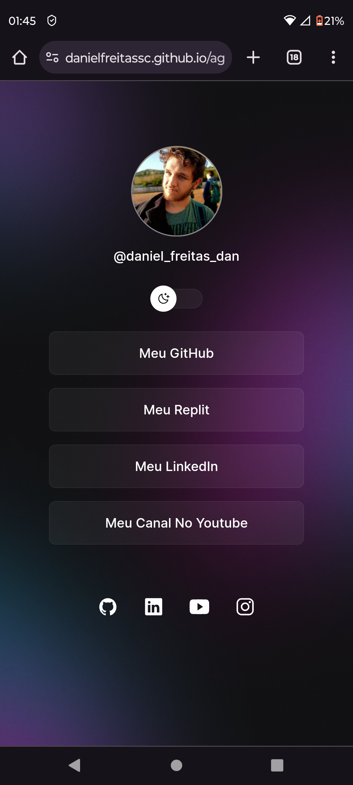
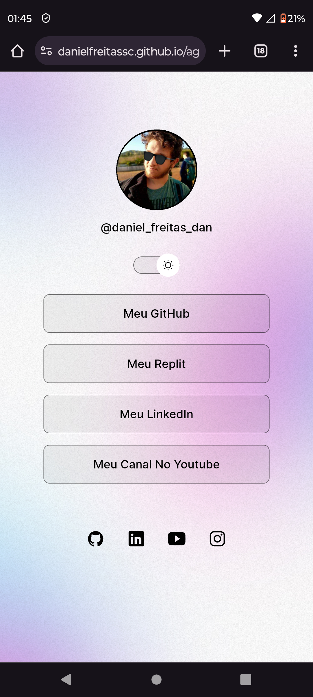

<h1>  Agregador de links </h1>

<h2> Este projeto é um agregador de links desenvolvido com intuito de facilitar o acesso a todas as minhas redes sociais <a href="https://github.com/DanielFreitassc" target="_blank">LINK DE ACESSO</a> </h2>
 
<h3>Dark mode</h3>

 
<h3 id="light">Light mode</h3>

 

###  🚀 Stacks

